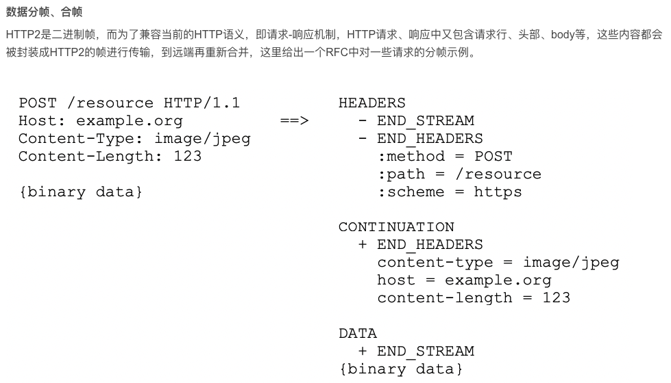

# http2基础知识

```
Fram帧类型
settings 			设置
ping 					测量来回时间


headers 			请求头
continuation 	请求头延续
data 					请求body, 响应body

push 					服务端推送

rst 					重置一个stream
goaway 				tcp连接优雅关闭


```





# nginx http v2

```
ngx_http_v2_init 入口函数
注册连接上的读函数 ngx_http_v2_read_handler
写函数 ngx_http_v2_write_handler


```

```
    ngx_http_v2_state_data,               /* NGX_HTTP_V2_DATA_FRAME */
    ngx_http_v2_state_headers,            /* NGX_HTTP_V2_HEADERS_FRAME */
    ngx_http_v2_state_priority,           /* NGX_HTTP_V2_PRIORITY_FRAME */
    ngx_http_v2_state_rst_stream,         /* NGX_HTTP_V2_RST_STREAM_FRAME */
    ngx_http_v2_state_settings,           /* NGX_HTTP_V2_SETTINGS_FRAME */
    ngx_http_v2_state_push_promise,       /* NGX_HTTP_V2_PUSH_PROMISE_FRAME */
    ngx_http_v2_state_ping,               /* NGX_HTTP_V2_PING_FRAME */
    ngx_http_v2_state_goaway,             /* NGX_HTTP_V2_GOAWAY_FRAME */
    ngx_http_v2_state_window_update,      /* NGX_HTTP_V2_WINDOW_UPDATE_FRAME */
    ngx_http_v2_state_continuation        /* NGX_HTTP_V2_CONTINUATION_FRAME */
```

