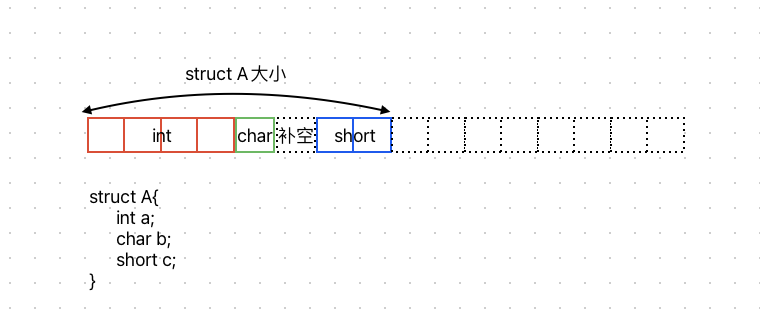

# 内存对齐

时间和空间的权衡, 如果连续存储空间占用会更小, 但是可能出现同一个数据需要读取两次, 会增加时间消耗

# 内存对齐规则

1. 数据成员对齐规则：结构（struct或联合union）的数据成员，第一个数据成员放在offset为0的地方，以后每个数据成员按其类型大小和默认对齐参数(32位系统通常默认按4字节对齐)中较小的一个对齐。每个成员的起始地址%每个成员的自身对齐值=0，否则补空直至满足条件。比如对于char型数据，其自身对齐值为1，对于short型为2，对于int型为4，double型在32位机大小为8字节、系统默认对齐方式是4字节，取其较小者，所以其对齐值是4。
2. 结构体作为成员：如果一个结构里有结构体成员，则按照其成员中自身对齐值最大的那个值对齐。（struct a里存有struct b，b里有char，int，double等元素，那b应该从4的整数倍开始存储。）
3. 收尾工作：结构体的总大小，也就是sizeof的结果，必须为所用过的最大对齐值的整数倍，不够就补空字节。比如在32位系统中最大对齐参数是4，如果一个结构中有类型为int、long、float、double等长度等于或大于4的成员，则其总大小必须是4的整数倍。

例如:



# 结构体中包含位域对齐规则

1. 如果相邻位域字段的类型相同，且其位宽之和小于类型的sizeof大小，则后面的字段将紧邻前一个字段存储，直到不能容纳为止
2. 如果相邻位域字段的类型相同，但其位宽之和大于类型的sizeof大小，则后面的字段将从新的存储单元开始，其偏移量为其类型大小的整数倍
3. 如果相邻的位域字段的类型不同，则各编译器的具体实现有差异，gcc通常采用压缩的方式
4. 如果位域字段之间穿插着非位域字段，则不进行压缩
5. 整个结构体的总大小为对齐方式的整数倍。对齐方式取最宽基本类型成员大小和默认对齐方式的较小者


# 内存对齐的其他控制

注意: 取消或者干预内存对齐晖增加内存访问产生的开销, 需要在使用时有所注意

结构体取消对齐优化

```c
struct __attribute__((__packed__)) MyStruct {
    int a;
    char b;
    float c;
};
```

自定义对齐大小

```c
#pragma pack(push, 1)
struct MyStruct {
    int a;
    char b;
    float c;
};
#pragma pack(pop)
```

