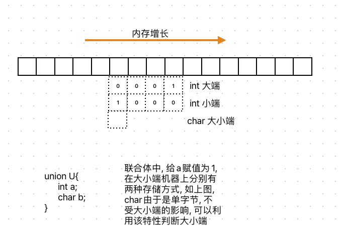

# 大小端测试

```c
#include <stdio.h>
#include <stdlib.h>
int check_sys()
{
    union {
      int i;
      char c;
    } un;
    un.i = 1;
    return un.c;//返回1表示小端，返回0表示大端
}


int check_sys_1()
{
    int a = 1;
    return *(char*)&a;//返回1表示小端，返回0表示大端
}

int main()
{
    int ret = check_sys();
    if (ret == 1)
    {
        printf("小端\n");
    }
    else
    {
        printf("大端\n");
    }
    return 0;
}
```


