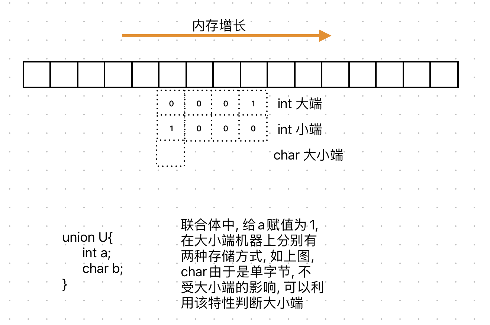

# 字节序

​	在网络编程中, 经常会遇到网络字节序和主机序, 就是一个对象由多字节组成的时候,  需要注意多个字节之间的顺序, 就是说一个对象的多个字节如何排序存放

​	除了字节序, bit序也在大小端、网络传输过程中有不同的排序方式, 需要注意

# 大小端




如何判断机器大小端

```c
#include <stdio.h>
#include <stdlib.h>
int check_sys()
{
    union {
      int i;
      char c;
    } un;
    un.i = 1;
    return un.c;//返回1表示小端，返回0表示大端
}


int check_sys_1()
{
    int a = 1;
    return *(char*)&a;//返回1表示小端，返回0表示大端
}

int main()
{
    int ret = check_sys();
    if (ret == 1)
    {
        printf("小端\n");
    }
    else
    {
        printf("大端\n");
    }
    return 0;
}
```

