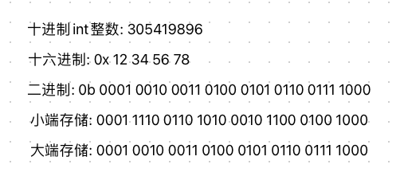
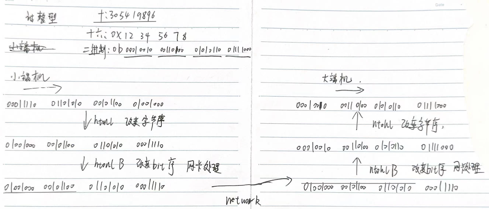

# 字节序

​	在网络编程中, 经常会遇到网络字节序和主机序, 就是一个对象由多字节组成的时候,  需要注意多个字节之间的顺序, 就是说一个对象的多个字节如何排序存放

​	除了字节序, bit序也在大小端、网络传输过程中有不同的排序方式, 需要注意

# 人类阅读序

人类在阅读时, 从左向右进行阅读, 所以先看到数字的高位, 最后才能看到数字低位, 所以人类的阅读顺序是天然的大端序

# 网络序

网络传输一般采用大端序, 也被称之为网络字节序, 或网络序.

即先发送高字节数据, 再发送低字节数据(这里的高低字节与人阅读数字的高位低位对应, 高位数字对应的就是高位字节, 从左往右, 位数依次降低. 从左到右即低内存到高内存, 依次发送高字节到低字节)

# 主机序

主机序有两种,  大端序和小端序,  也就是说主机序是多样的,  并不是统一的, 网络编程时需要注意

# 大小端


如何判断机器大小端

```c
#include <stdio.h>
#include <stdlib.h>
int check_sys()
{
    union {
      int i;
      char c;
    } un;
    un.i = 1;
    return un.c;//返回1表示小端，返回0表示大端
}


int check_sys_1()
{
    int a = 1;
    return *(char*)&a;//返回1表示小端，返回0表示大端
}

int main()
{
    int ret = check_sys();
    if (ret == 1)
    {
        printf("小端\n");
    }
    else
    {
        printf("大端\n");
    }
    return 0;
}
```


# 大小端中字节内bit的顺序

比特序就是一个字节中8个比特位(bit)之间的顺序问题, 一般情况下系统的比特序和字节序是保持一致的.

比特序大端: 将最高有效比特位放在了bit0,  最低有效比特位放在了bit7

比特序小端: 将最低有效比特位放在了bit0,  最高有效比特位放在了bit7

**字节序转化函数, 是否会把bit序一块转化?**

并不会, bit序在机器上存储方式固定, 没有提供转化bit序的函数, bit序在网络传输时, 网卡负责转化为统一的转化为网络序, 这一过程用户、程序、软件都是不可见的

**网络序中的bit序是怎么排列的?**

网络字节序是大端序, 但是他的bit序却是按照小端进行排序的, 与常见的大端机器并不是一样的

**c语言中的位域可以使用bit, 有什么规律**

对于位域有个约定, 如果C语言的结构体中包含了位域, 如果位域A出现在位域B之前, 那么A总是出现在低序的bit位

**既然bit也有顺序, 那针对bit的操作左移、右移是否在不同机器上有差异?**

理解是没有差异的, 左右移动都是按照人容易理解的大段实现的, 在小端上操作会做转化, 执行的结果应该是在大小端机器上无差异

**注:**所有的位操作运算符, 都不用关心大小端机器, 都由操作系统做转化统一

## bit序列存储差异



# 字节流传输

网络传输本质上是面向字节流的传输, 单字节的传递并没有意义, 只有在多字节类型(int short 等 string不算)的传输还原过程中, 需要注意大小端差异  


# 传输例子

一个int类型的整数, 从小端机器经过网络传输到大端机器的过程



**注**: 如果是传输单字节, 就没有htonl和ntohl那种字节序的转化, 直接进行字节流传输即可,

htonl和ntohl都是为了兼容大小端差异, `应用层自己处理的`, 网络传输函数只负责传输`字节流`


