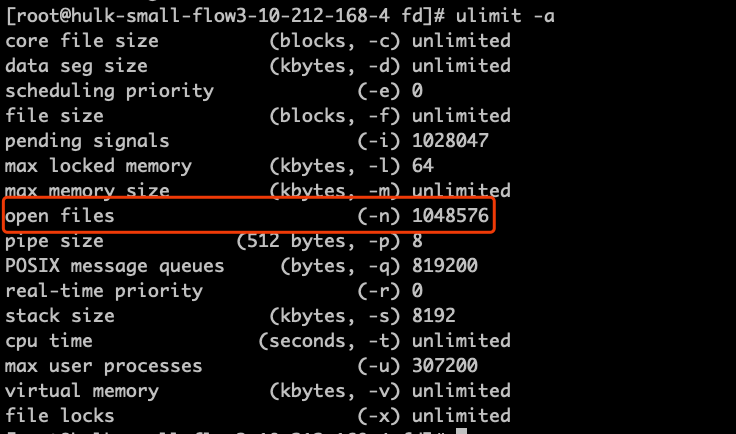
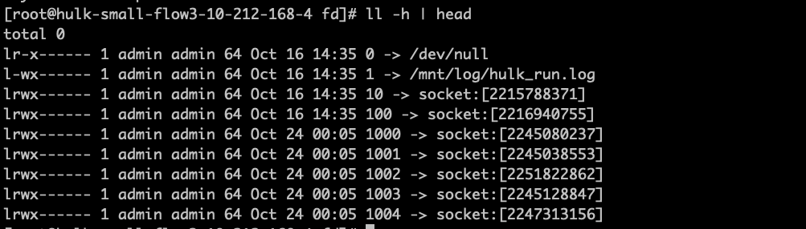

你系统针对fd资源的限制

ulimit -a

lsof 可以列出当前系统下所有进程打开的fd文件, 利用统计命令可以看到每个进程id打开的fd数量, 通过一段时间观察, 可以看到哪个进程的fd数量一直在增加

lsof |awk '{print $2}'| sort | uniq -c | sort -nr | head

定位到进程之后,  对应目录下可以看到进程的所有fd信息 /proc/973/fd , 执行 ll -h

可以发现泄露的fd类型, 如果想查看详细的泄露fd信息, 也可以通过lsof -p 973查看

查看具体泄露代码, 可以查看进程的堆栈信息, 利用stace 和pstack 命令

